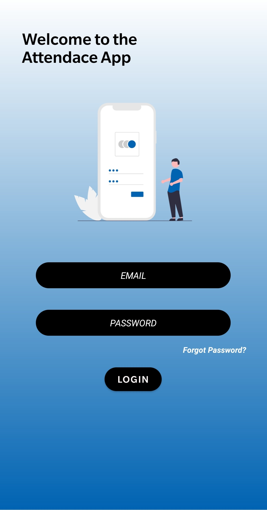
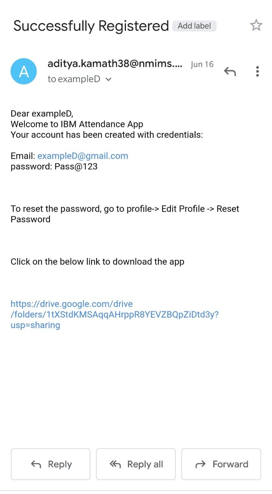

# Attendance-App

Problem Statement:

Due to pandemic, it is hard for corporates to keep track of its employee's attendance due to work from home regulation. To tackle this and to find if the employees are actually working from home and not on vacation, I built an attendance app which stamps in the geolocation of the user. 

Project Description:

Built an attendance app in which the employer can get all the detailed information of the employee like information of clock-in or clock-out using geo location.  There are three users:
1. Admin
2. Employer
3. Employee
All the 3 users have different roles and different UI. We also need to store the attendance in a real time database(Firebase) and fetch it accordingly.

Features:
1. In app pdf view for documents.
2. Real time uploads and fetching of records using Firebase.
3. Excel view and download format of attendance records.
4. Single page sign-in for all 3 users.(Using one page for login, according to database, users are directed to their perspective pages.)
5. Using Geotag to store the location address.

Challenges Faced:
1.  Learn Android development from scratch and develop an app within 5 weeks.
2.  Learn firebase
3.  Single page login access for all users.
4.  Send login access through mail from employer to the new employees added.(from app itself)

Project Presentation:

https://github.com/iamadityakamath/Attendance-App/blob/master/Attendance%20App%20Presentation.pdf

User Guide:

https://github.com/iamadityakamath/Attendance-App/blob/master/User%20Guide.pdf

Image ScreenShots:

